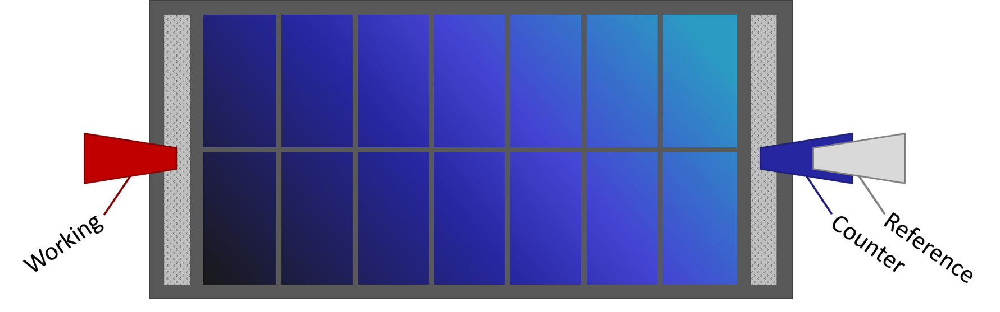
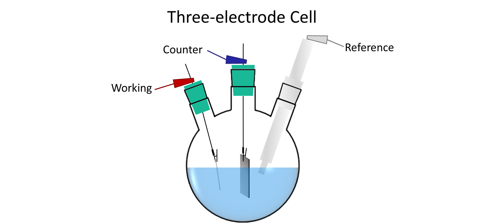

.. _setup:

=================
Experiment Setup
=================

A variety of cells can be characterized using a potentiostat. This section will briefly describe cell preparation and
attachment to the potentiostat.

Types of Cell Arrangements
===========================

Most potentiostats (including the JUAMI Potentiostat) have the option to connect three electrodes to an electrochemical
cell. Electrochemical cells/devices commonly have two or three leads. An important distinction between the two
arrangements is how the potential is measured.

In a three electrode cell, there is a working electrode (with the material or reaction of interest), counter electrode
(completes the circuit and allows charge to flow by facilitating a counter reaction), and reference electrode (stable
redox couple that with high impedance to minimize electrode polarization).
The voltage value measured will be dependent on the type of reference electrode that is used in the experiment.

In a two electrode cell, the counter electrode is used to measure the voltage instead of a reference. While the
reactions occur at each electrode, the potential of both electrodes can change from cell polarization causing a voltage
drift. This type of setup is adequate when you aren't interested in measuring the absolute voltage.

Overall, the two electrode arrangement measures the cell potential (and requires a good understanding of what is
happening at each electrode) and the three electrode arrangement enables the measurement of the potential solely of the
working electrode against a known reference potential such as that of Ag/AgCl in KCl. See the examples below for
instructions on how to connect the potentiostat to each type of cell.

Materials and Instrumentation
==============================

All experiments will require:

#. Computer
#. JUAMI Potentiostat
#. USB AB cable
#. Enthusiasm for electrochemistry! \\o/

If testing a device (e.g. battery, solar cell, resistor, etc.), it can be attached directly to the potentiostat as
described below.

If testing an open cell (e.g. H cell, three-neck cell, etc.) you will need each of the following components.

#. Glassware for electrochemical cell (could be three-neck flask, beaker, etc.)
#. Working electrode
#. Counter electrode
#. Reference electrode (if using three-electrode setup)
#. Electrolyte

.. important:: Take proper safety precautions!

    #. If you have never run an electrochemical reaction before, perform these experiments with a lab partner or consult
       with an instructor. This potentiostat can not generate a high voltage to shock you but other commercial
       instruments may.
    #. Wear personal protective equipment (PPE; gloves, safety glasses, lab coat) when carrying out experiments.
    #. Read the safety data sheet (SDS) for all materials, understand the reactions that are expected, and familiarize
       yourself with the potential risks of reaction product. Take necessary actions to prevent the formation of or
       exposure to dangerous gases/chemicals (e.g. carry out experiments in a fume hood).

Two-electrode experiment
=========================

Examples
_________

* Resistor
* Battery
* Solar cell
* Fuel cell

Cell/Device Connection
_______________________

In each of these applications, the electrochemical cell only has two electrical leads. However, the potentiostat has
three clips. To connect the potentiostat to one of these cells, attach the potentiostat reference electrode clip (white)
to the potentiostat counter electrode clip (blue). Now there should be a working electrode clip (red) and a
counter/reference clip (blue/white) to attach to the two leads on the electrochemical cell, as shown in below.

.. rubric:: Figure 1: Two electrode solar cell diagram that shows the connection of the working electrode clip to one
            electrical contact (typically positive) and the counter and reference electrode clips connected to the other
            electrical contact (typically negative).

.. note:: The colors associated with the potentiostat wires can change depending on the convention used by the person
          building the potentiostat. If you built the JUAMI Potentiostat you are using, be sure to record which color
          was associated with each electrode. If the JUAMI Potentiostat was built by someone else, check the
          documentation that the builder might have provided you or contact them to find out what convention was used.

Three-electrode experiment
===========================

Examples
_________

* Measure redox couples
* Electroanalytical experiments
* Rotating disk electrode
* Many others

Cell/Device Connection
_______________________

All three clips from the potentiostat can be attached to their respective electrodes in the cell, as shown below. For
best practice, try to position the tip of the reference electrode as close as possible to the working electrode to
minimize uncompensated solution resistance. This is most important in systems with low electrolyte conductivity. 

.. rubric:: Figure 2: Example of a three electrode setup in a three-neck round-bottom flask with a Pt rod counter
            electrode, foil working electrode, and a reference electrode in an aqueous electrolyte.

