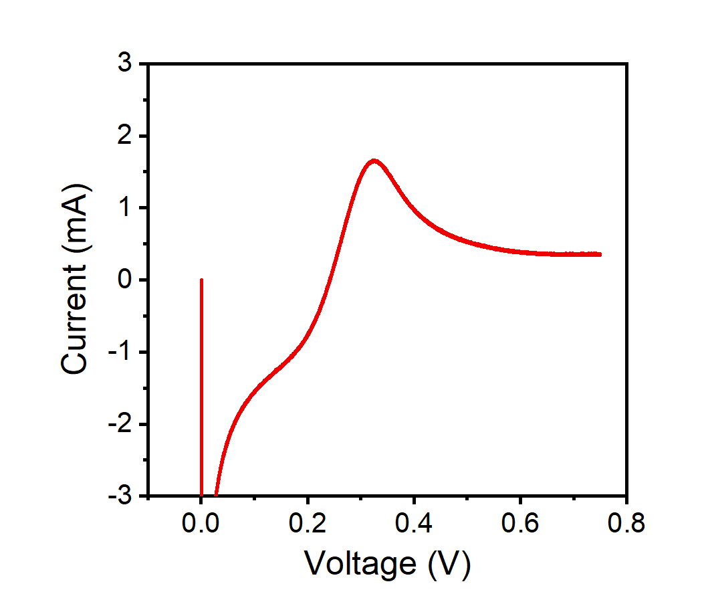
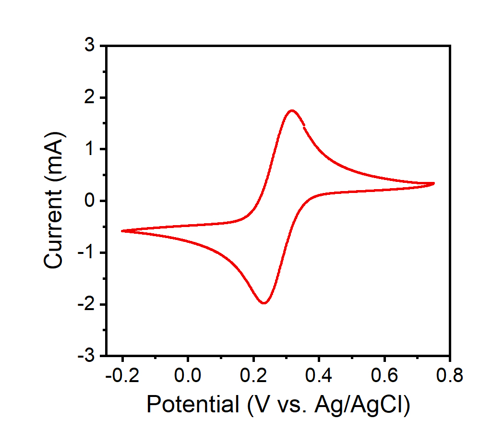

Electrochemical Techniques
===========================

This page is designed to help users choose the best electrochemical testing technique for a given experiment. The JUAMI
potentiostat offers three techniques for testing electrochemical systems - linear sweep voltammetry, cyclic
voltammetry, and chronoamperometry. An introduction to each technique is below.

Linear Sweep Voltammetry (LSV)
------------------------------

Linear sweep voltammetry applies a potential that sweeps from one potential to a final potential and measures the
current response from the electrochemical system. This technique allows a user to specifically analyze an oxidation
(anodic) or a reduction (cathodic) reaction based on the direction (+/-) of the potential scan.

User Inputs:

* start_voltage (V)
* end_voltage (V)
* sweep_rate (mV/s)

Applied Waveform:

.. image::

Measured Waveform:

.. image::

After completion of an LSV experiment the data file contains time, voltage and current. Using this information, one
can plot current vs. voltage, shown below, which is typically the most useful way to plot the results from a LSV scan. Additional
LSV measurements with different sweep rates can be used to investigate changes in electrochemical behavior as a function
rate.

Some applications the LSV can be uniquely used for are measuring current vs. voltage of a resistor, measuring the current
response of an irreversible process (where cyclic voltammetry would not provide additional information) and when one
desires to retain the oxidized or reduced form of the electrode material without reversing it back to its original state.

Cyclic Voltammetry (CV)
-----------------------

Similar to LSV, cyclic voltammetry sweeps between two user-defined potentials at a specific sweep rate. However, as the
name suggests, this technique performs the forward and reverse scans in a cyclic manner for a certain number of cycles.
This provides information about performance characteristics, reversibility and kinetic difference between anodic and
cathodic processes.

User Inputs:

* start_voltage
* first_turnover_voltage
* second_turnover_voltage
* sweep_rate
* number_of_cycles

Applied Waveform:

.. image::

Measured Waveform:

.. image::

Similar to LSV, it is useful to plot i vs. V, as shown below. This can provide information such as overpotential and
changes in peak separation as a function of sweep rate for experiments that involve cycles with multiple sweep rates.

Chronoamperometry (CA)
----------------------

